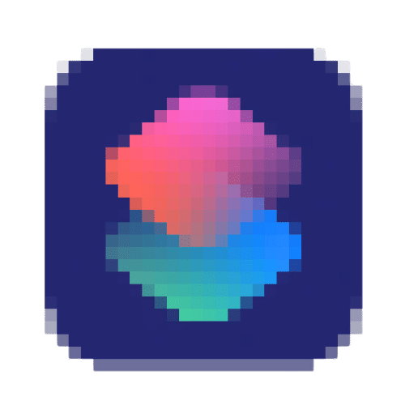

  

  
    <b>Siri Shortcuts Virtual Machine (SSVM)</b>
  

**SSVM** is a compiler infrastructure for Siri Shortcuts programming languages. It consist of an intermediate representation and the backend that compiles this SSVM IR to a runnable Siri Shortcut. It is inspired by the LLVM project.

### Aim
Previously, there had been many attempts to create compilers to programmatically generate Siri Shortcuts. Many of them were abonded because Shortcuts change with every IOS/iPadOS/macOS update, and it is really hard to keep track. Existing languages try to keep up with the updates themselves. However, this problem can be solved by creating a common compiler backend, which will be the only component that requires change with IOS/iPadOS/macOS updates.
